# CloudOpsHub Architecture Diagram

> This document describes the full architecture of the CloudOpsHub platform — from code commit to production deployment.

Diagram images are available in `docs/diagrams/` in both **SVG** and **PNG** formats.

---

## High-Level Overview

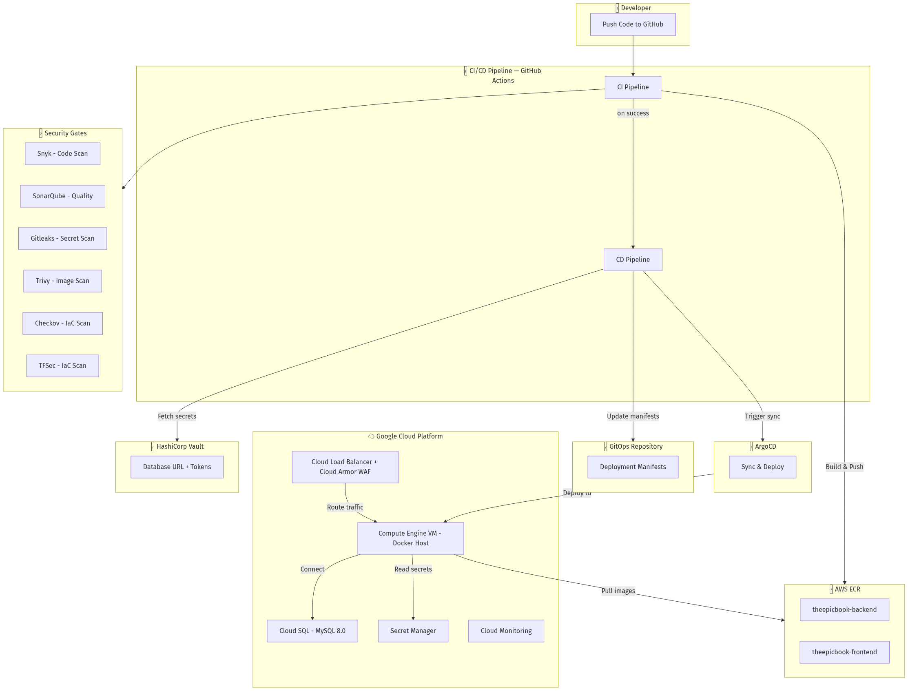

<details>
<summary>Mermaid source (click to expand)</summary>

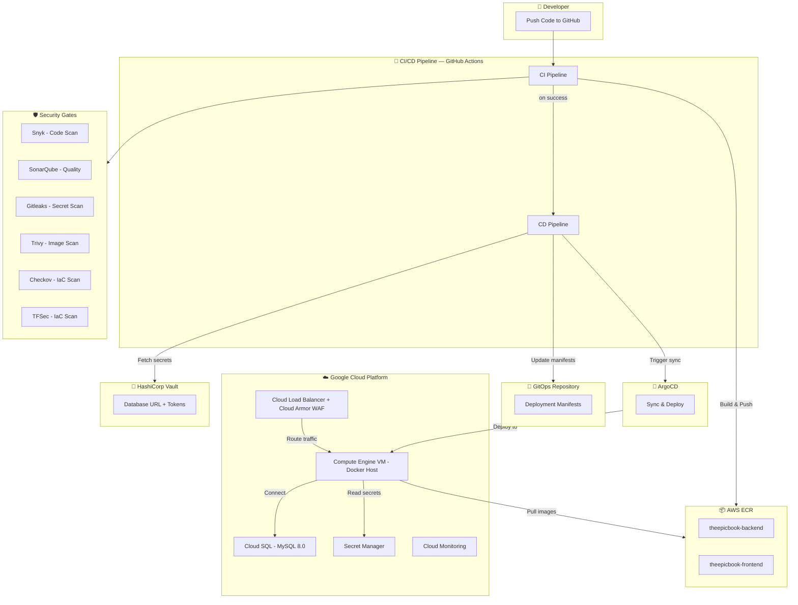

</details>

---

## Application Architecture (3-Service Microservices)

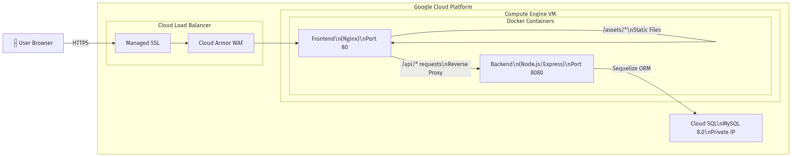

<details>
<summary>Mermaid source (click to expand)</summary>

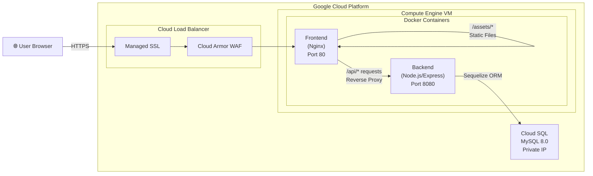

</details>

### Service Details

| Service | Technology | Port | Role |
|---------|-----------|------|------|
| **Frontend** | Nginx 1.25 | 80 | Serves static assets (CSS, JS, images), reverse proxies API and page requests to backend |
| **Backend** | Node.js 16 + Express | 8080 | Handlebars SSR, REST API for cart operations, Sequelize ORM for database |
| **Database** | Cloud SQL (MySQL 8.0) | 3306 | Stores books, authors, cart, and checkout data. Private IP only. |

---

## CI/CD Pipeline Flow

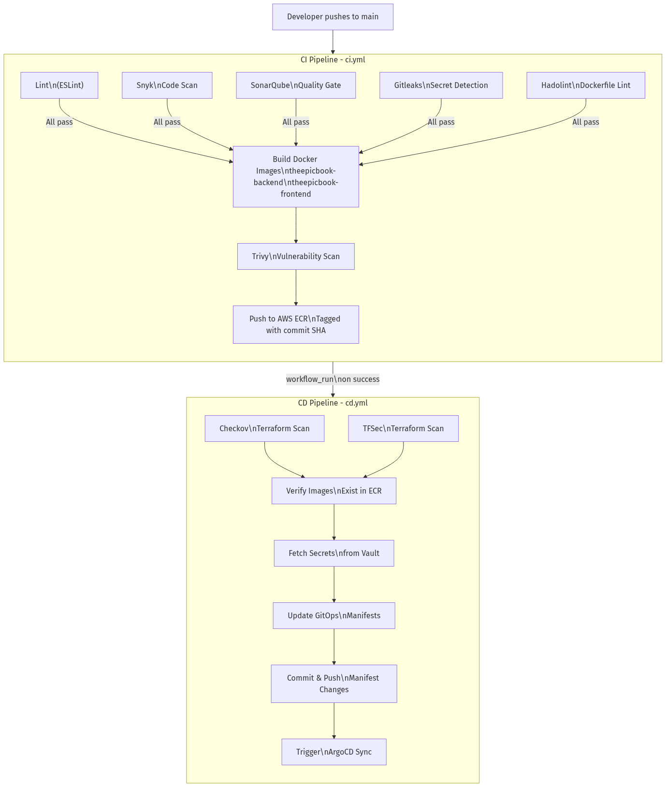

<details>
<summary>Mermaid source (click to expand)</summary>

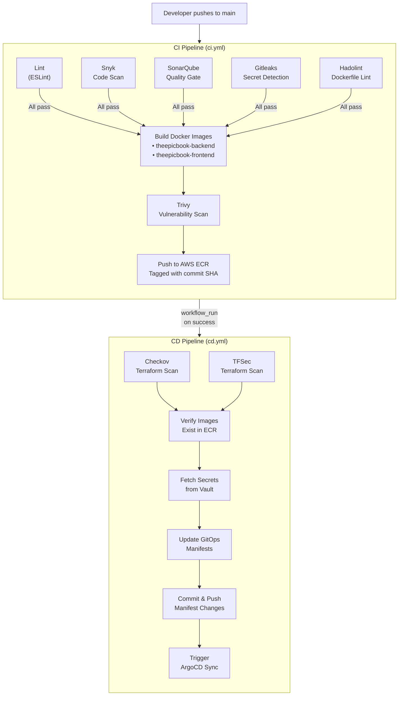

</details>

### DevSecOps Security Gates

| Stage | Tool | What It Checks |
|-------|------|---------------|
| **Code** | Snyk | Known vulnerabilities in dependencies |
| **Code** | SonarQube | Code quality, bugs, code smells, security hotspots |
| **Commit** | Gitleaks | Hardcoded secrets, API keys, passwords in code |
| **Build** | Hadolint | Dockerfile best practices |
| **Build** | Trivy | Container image vulnerabilities (OS + app packages) |
| **Deploy** | Checkov | Terraform misconfigurations and security issues |
| **Deploy** | TFSec | Terraform security best practices |
| **Operate** | HashiCorp Vault | Runtime secret injection (no secrets in code/env files) |

---

## GCP Infrastructure (Terraform-managed)

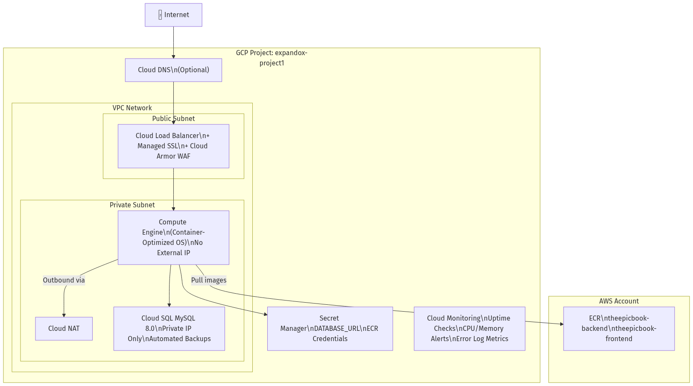

<details>
<summary>Mermaid source (click to expand)</summary>

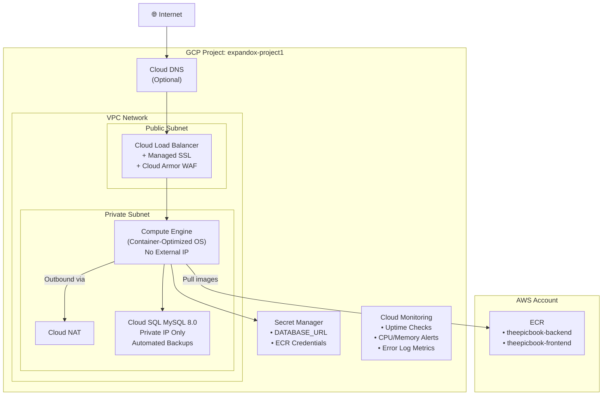

</details>

### Terraform Module Structure

```
terraform/
├── main.tf                    # Root — wires all modules together
├── variables.tf               # Input variables
├── outputs.tf                 # Output values
├── envs/
│   ├── dev.tfvars             # Dev environment values
│   ├── staging.tfvars         # Staging environment values
│   └── production.tfvars      # Production environment values
└── modules/
    ├── network/               # VPC, subnets, NAT, firewall rules
    ├── compute/               # GCE instance, service account, IAM
    ├── database/              # Cloud SQL, private IP, backups
    ├── load_balancer/         # Global LB, Cloud Armor, SSL, DNS
    ├── storage/               # GCS buckets, Artifact Registry
    ├── secrets/               # Secret Manager entries
    ├── monitoring/            # Uptime checks, alert policies
    └── registry/              # AWS ECR repositories
```

---

## GitOps & Environment Management

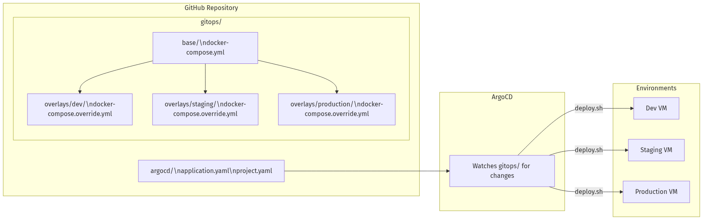

<details>
<summary>Mermaid source (click to expand)</summary>

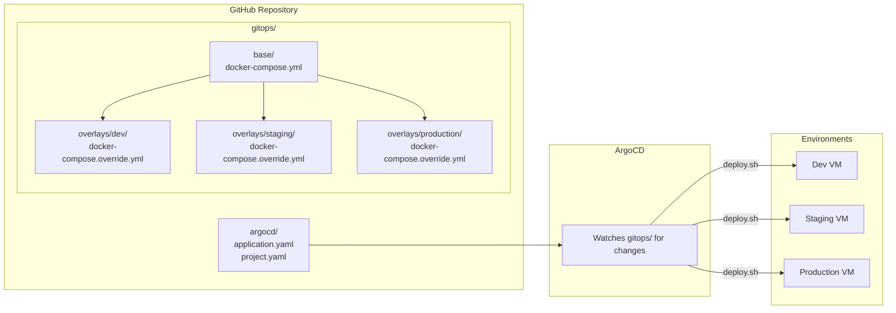

</details>

### Environment Differences

| Setting | Dev | Staging | Production |
|---------|-----|---------|------------|
| `NODE_ENV` | development | staging | production |
| Memory limit | 256MB | 512MB | 1GB |
| Database | Cloud SQL (small) | Cloud SQL (medium) | Cloud SQL HA (high availability) |
| Terraform workspace | `dev` | `staging` | `production` |

---

## Monitoring Stack

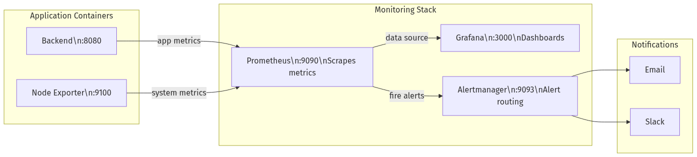

<details>
<summary>Mermaid source (click to expand)</summary>

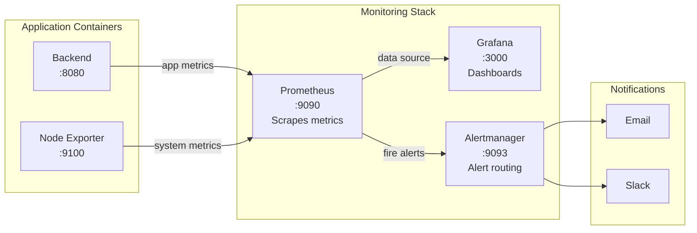

</details>

### Alert Rules

| Alert | Condition | Severity |
|-------|-----------|----------|
| Container Down | Container unreachable for > 1 min | Critical |
| High CPU | CPU > 80% for > 5 min | Warning |
| High Memory | Memory > 80% for > 5 min | Warning |
| Low Disk Space | Disk < 10% free | Critical |

---

## Network & Security Architecture

```
┌─────────────────────────────────────────────────────────────┐
│                        INTERNET                              │
└──────────────────────────┬──────────────────────────────────┘
                           │ HTTPS (443)
                           ▼
┌──────────────────────────────────────────────────────────────┐
│  Cloud Load Balancer                                         │
│  ┌────────────────────────────────────────────────────────┐  │
│  │  Cloud Armor WAF                                       │  │
│  │  • Rate limiting (1000 req/min)                        │  │
│  │  • SQL injection blocking                              │  │
│  │  • XSS attack blocking                                 │  │
│  └────────────────────────────────────────────────────────┘  │
│  ┌────────────────────────────────────────────────────────┐  │
│  │  Managed SSL Certificate                               │  │
│  │  • Automatic renewal                                   │  │
│  │  • HTTP → HTTPS redirect                               │  │
│  └────────────────────────────────────────────────────────┘  │
└──────────────────────────┬──────────────────────────────────┘
                           │ HTTP (80)
                           ▼
┌──────────────────────────────────────────────────────────────┐
│  GCP VPC (Private Network)                                   │
│                                                              │
│  ┌──────────────────────────────────────────────────┐       │
│  │  Compute Engine VM (No External IP)              │       │
│  │                                                  │       │
│  │  ┌──────────┐    ┌───────────┐                  │       │
│  │  │ Frontend │───▶│  Backend  │                  │       │
│  │  │ (Nginx)  │    │ (Node.js) │                  │       │
│  │  │  :80     │    │  :8080    │                  │       │
│  │  └──────────┘    └─────┬─────┘                  │       │
│  │                        │                         │       │
│  └────────────────────────┼─────────────────────────┘       │
│                           │ Private IP (3306)                │
│                           ▼                                  │
│  ┌──────────────────────────────────────────────────┐       │
│  │  Cloud SQL (MySQL 8.0)                           │       │
│  │  • Private IP only (no public access)            │       │
│  │  • Automated daily backups                       │       │
│  │  • High Availability (production only)           │       │
│  │  • Query insights enabled                        │       │
│  └──────────────────────────────────────────────────┘       │
│                                                              │
│  Cloud NAT ──────────▶ Internet (outbound only)             │
│  (VM uses this for ECR pulls, package installs)              │
│                                                              │
│  Firewall Rules:                                             │
│  • Allow HTTP from Load Balancer health checks only          │
│  • Allow SSH via IAP (Identity-Aware Proxy) only            │
│  • Allow internal traffic between VM and Cloud SQL           │
│  • Deny all other inbound traffic                            │
└──────────────────────────────────────────────────────────────┘
```

---

## Data Flow Summary

```
User Request Flow:
User → DNS → Load Balancer → Cloud Armor → Nginx → Node.js → Cloud SQL

Deployment Flow:
Git Push → CI (lint + security) → Build → ECR → CD → GitOps → ArgoCD → VM

Secret Flow:
Vault → CD Pipeline → GitOps Manifests
Secret Manager → VM Startup Script → Docker Environment

Monitoring Flow:
Backend → Prometheus → Grafana (dashboards)
                    → Alertmanager → Email/Slack
```

---

## Regenerating Diagram Images

Pre-rendered PNG and SVG images are in `docs/diagrams/`. To regenerate them after editing the Mermaid source blocks above:

```bash
# Extract a mermaid block to a .mmd file, then render it:
npx @mermaid-js/mermaid-cli@10.6.1 -i diagram.mmd -o diagram.png -b white

# Or use the Kroki API (no local install needed):
curl -sf -X POST https://kroki.io/mermaid/png --data-binary @diagram.mmd -o diagram.png
curl -sf -X POST https://kroki.io/mermaid/svg --data-binary @diagram.mmd -o diagram.svg
```

Other viewing options:
- **GitHub** renders Mermaid blocks natively when viewing this file
- **Mermaid Live Editor**: Paste any block into [mermaid.live](https://mermaid.live)
- **VS Code**: Install the "Markdown Preview Mermaid Support" extension
